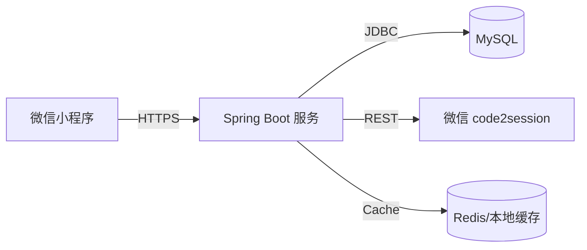

# 大学生跑步打卡小程序整体方案

## 1. 技术栈与部署拓扑
- **前端**：微信原生小程序（地图组件 + 轨迹绘制 + WebSocket/HTTP）。
- **后端**：Spring Boot 3.x、Spring Data JPA、Validation、MapStruct（可选）、Redis（会话与排行榜缓存，可先使用内存 ConcurrentHashMap 过渡）。
- **存储**：MySQL 8.x（运行记录、用户资料），对象存储（可选，用于轨迹导出）。
- **第三方**：微信 `code2session` 接口（用户身份换取 openId）。

## 2. 模块划分
1. **Auth 模块**：对接 `code2session`，生成 `sessionToken`（自定义 UUID 或 JWT），提供用户上下文解析。
2. **User/Profile 模块**：维护头像、昵称、学校、班级、语音提醒配置。
3. **RunRecord 模块**：
   - 记录单次跑步（模式、目标距离、轨迹点、配速、消耗、暂停片段）。
   - 负责里程累积、图表统计。
4. **Leaderboard 模块**：按日/月聚合里程并排序，支持同校/全站筛选。
5. **History & Stats 模块**：分页展示历史记录、周/月累计柱状图。
6. **Alert & Exception 模块**：GPS、网络、权限异常提示。

## 3. 数据模型
| 表 | 核心字段 | 说明 |
| --- | --- | --- |
| `users` | `id`, `open_id`, `nickname`, `avatar_url`, `school`, `class_name`, `voice_enabled`, `created_at`, `updated_at` | 用户档案，openId 唯一 |
| `user_sessions` | `id`, `user_id`, `token`, `expires_at`, `created_at` | 存储会话 token，用于小程序 Header 鉴权 |
| `run_records` | `id`, `user_id`, `mode`, `target_distance_m`, `distance_m`, `duration_s`, `avg_pace`, `calories`, `start_time`, `end_time`, `gps_track_json`, `status` | 记录跑步详情，轨迹 JSON 保存 polyline 点数组 |
| `run_pause_segments` *(可选)* | `id`, `run_id`, `start_time`, `end_time` | 暂停片段（暂停/继续） |

> 排行榜与统计无需额外表，可通过 `run_records` 视图/聚合 SQL 计算并缓存。

## 4. 核心 API（草案）
| Method | Path | 说明 |
| --- | --- | --- |
| `POST` | `/api/auth/login` | 使用 `wx.login` 返回的 `code` + 用户基础信息换取 `sessionToken`、用户档案 |
| `GET` | `/api/profile` | 读取当前用户资料 |
| `PUT` | `/api/profile` | 更新头像、昵称、学校、语音提醒等 |
| `POST` | `/api/runs` | 上报一次跑步结果（包含轨迹、距离、时间、模式） |
| `GET` | `/api/runs` | 历史记录分页：`?page=0&size=10&period=MONTH` |
| `GET` | `/api/runs/{id}` | 单次记录详情（轨迹、配速、语音文案） |
| `GET` | `/api/stats/summary` | 汇总今日/本周/本月里程、连续打卡天数 |
| `GET` | `/api/leaderboard` | 排行榜：`?scope=DAY|MONTH&school=xxx` |
| `GET` | `/api/settings` *(可归并 profile)* | 配置项，如语音提醒、单位 |

所有需要登录的接口通过 `X-Session-Token` Header 识别用户。

## 5. 小程序信息架构
1. **TabBar 页面**
   - `首页`：地图 + 轨迹草图、跑步模式切换（目标跑/自由跑/课程跑等），中央「GO」按钮。
   - `记录`：历史列表 + 周/月图表，下拉刷新、可跳转详情。
   - `我的`：个人资料、语音开关、学校班级绑定。
2. **流程子页面**
   - `pages/run/index`：倒计时、实时数据（距离/时间/配速）、暂停/结束按钮、语音提醒。
   - `pages/result/index`：地图轨迹、成绩摘要、日/月排行榜卡片。

## 6. 关键交互
1. **授权与定位**：首次进入首页即提示定位授权，未授权展示骨架屏 + 引导。
2. **跑步中**：
   - `wx.startLocationUpdateBackground` 获取轨迹，生成 polyline。
   - 每公里触发语音（本地 TTS 或后端返回文案，前端使用 `wx.playBackgroundAudio`）。
   - 暂停状态置灰地图和计时。
3. **结束**：完成后上传数据，等待接口返回排行榜与评价文案。
4. **异常提示**：GPS 弱、网络断开、token 过期时 toast + 引导重新登录。

## 7. 里程碑
| 版本 | 范围 |
| --- | --- |
| V1 | 登录鉴权、跑步记录上传、历史列表、基础排行榜 |
| V1.1 | 语音配置、统计图表、离线缓存/补传 |
| V1.2 | 课程模板、班级排行榜、后台运营面板 |

---
如需调整（例如引入 WebSocket 进行实时配速广播、或拆分微服务），可在 V1 验收后迭代。